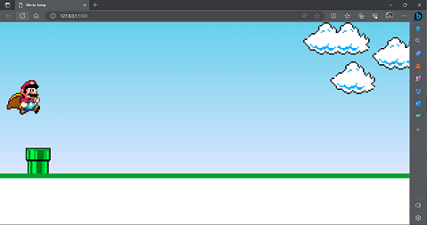
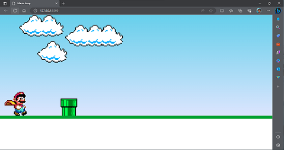
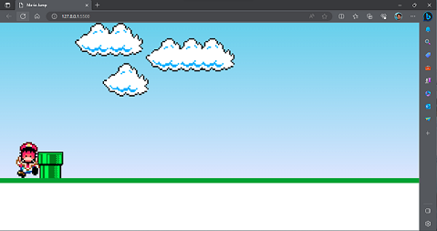

# Mario-With-JavaScript
Jogo simples do Mario.
Feito fisica de salto e colisão.

## Tecnologias utilizadas

<ul>
<li>HTML</li>
<li>CSS</li>
<li>JAVASCRIPT</li>
</ul>

### Link para visialização
https://mario-with-java-script.vercel.app/
